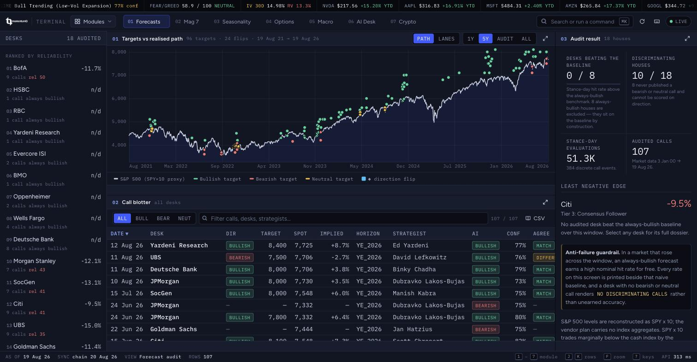
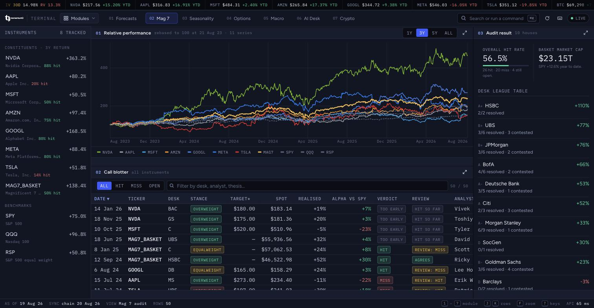
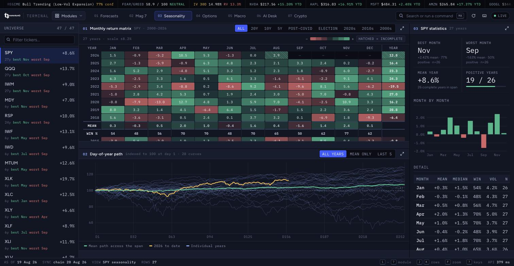
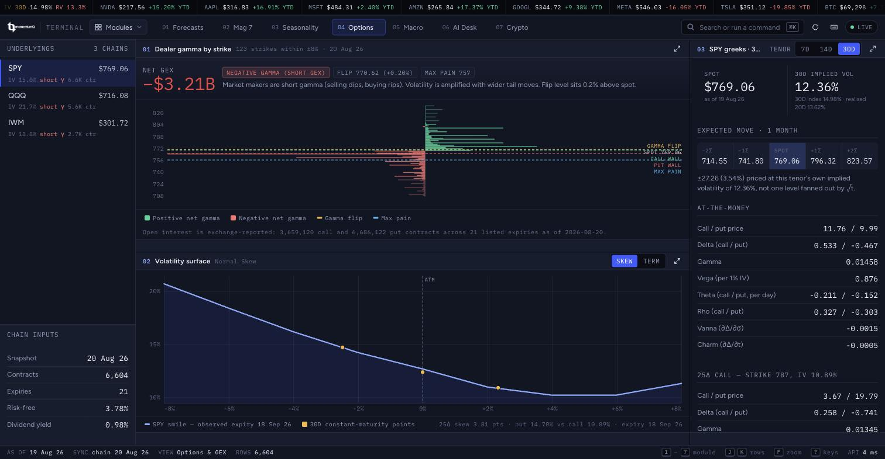
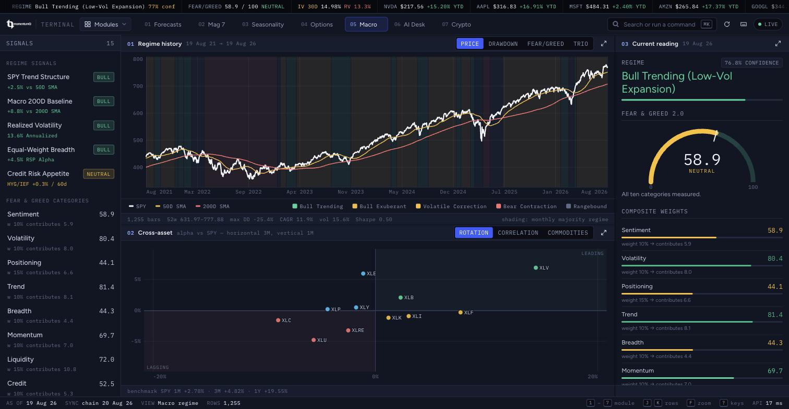
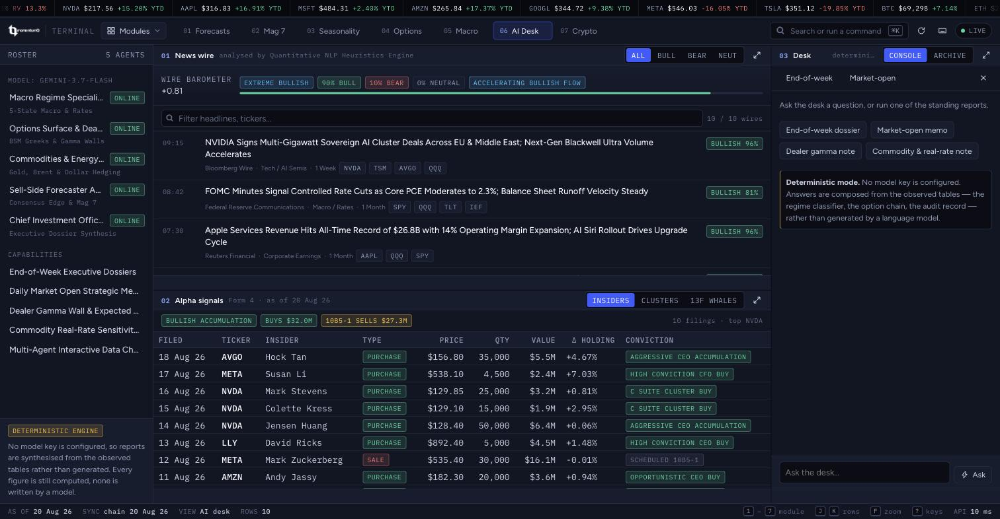
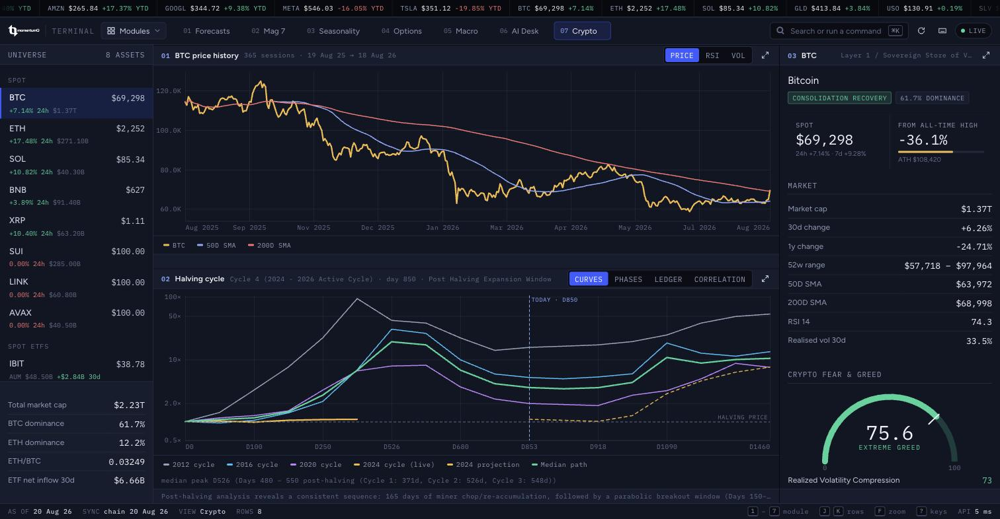
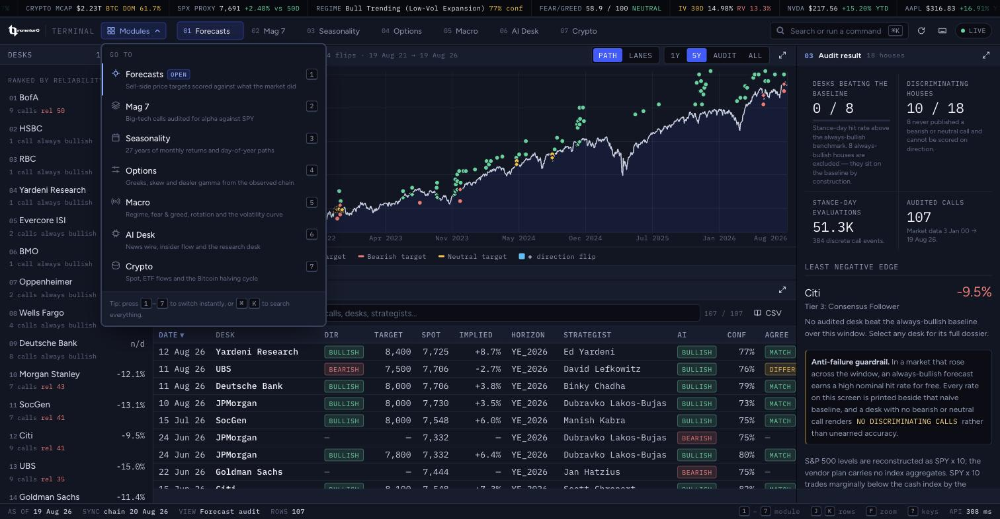
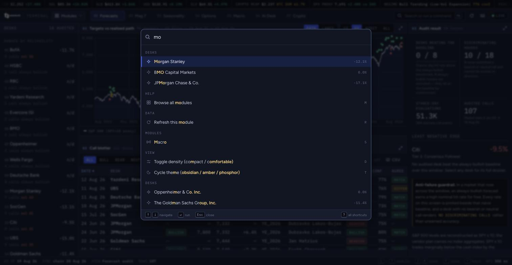
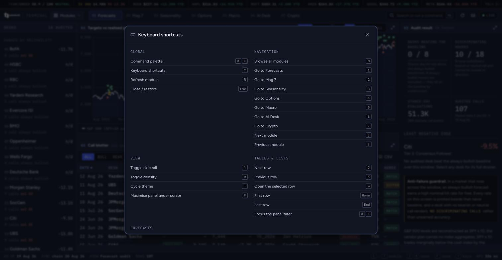

# MomentumQ Terminal v2

[](https://opensource.org/licenses/MIT)
[](https://www.python.org/)
[](https://fastapi.tiangolo.com)
[](https://pytest.org)
[](web/app/main.js)

An institutional-grade, open-source quantitative research platform and analytics terminal evaluating Wall Street sell-side research calls (2021–2026), multi-asset seasonality, cross-asset macro regimes, Black-Scholes-Merton (BSM) options Greeks & dealer GEX positioning computed from observed option chains, Fear & Greed Index 2.0, and a model-free implied volatility term structure.




<p align="center"><em>Forecasts — desk rail, published targets against the realised path, call blotter, audit dossier. One screen, no scrolling.</em></p>

---

## Screens

Seven modules, one page. Nothing scrolls at the document level: each panel
scrolls its own body, so the answer stays on screen and switching modules never
loses your place.

| | |
|:--|:--|
| **Mag 7** — big-tech calls audited for alpha against SPY<br> | **Seasonality** — 27 years of monthly returns and day-of-year paths<br> |
| **Options** — Greeks, skew and dealer gamma from the observed chain<br> | **Macro** — regime, fear &amp; greed, rotation and the volatility curve<br> |
| **AI Desk** — news wire, insider flow and the research desk<br> | **Crypto** — spot, ETF flows and the Bitcoin halving cycle<br> |

### Getting around

| | |
|:--|:--|
| **Modules menu** — names every module and what is in it, with its key beside it. The way in if you have never met the shortcuts.<br> | **Command palette** (<kbd>⌘K</kbd>) — fuzzy search over modules, desks, instruments, reports and views.<br> |
| **Keyboard shortcuts** (<kbd>?</kbd>) — generated from the live binding registry, so it can never drift from what the keys actually do.<br> | |

---

## Key Modules & Analytics

### 1. Sell-Side Direction Scorecard (`#/forecasts`)
- **Rigorous Direction Classifier**: Evaluates price targets against realized market prices using a strict $\pm 2.0\%$ indifference band. No subjective overrides.
- **Consensus Free-Rider Problem**: Measures empirical alpha against naive always-bullish baselines rather than unearned nominal win rates.
- **Anti-Failure Display**: Strategy desks with no discriminating bearish/neutral calls render `NO DISCRIMINATING CALLS` rather than inflated 100% scores.
- **Relative Allocation Benchmark**: Overweight/Underweight calls are scored against global equity benchmarks (`ACWI`) rather than nominal zero.
- **Interactive Price Chart**: Displays Wall Street bank price targets vertically aligned with historical price action.

### 2. Magnificent 7 Big Tech Stock Breakdown (`#/mag7`)
- **Constituents**: `NVDA`, `AAPL`, `MSFT`, `AMZN`, `GOOGL`, `META`, `TSLA` + Equal-Weight `MAG7` Basket.
- **Split-Adjusted Target Normalization**: Reconciles historical published targets with retroactive stock splits.
- **Ticker Lineage Reassembly**: Reconstructs continuous corporate history (e.g. `FB` $\rightarrow$ `META` continuous boundary).
- **Thematic Dossiers**: Quantitatively cross-checks editorial claims against verified broker records.

### 3. Cross-Asset Seasonality & Cumulative Path Curves (`#/seasonality`)
- **27-Year Daily Cycle Curves**: Forward-fills completed years to 252 trading days, eliminating calendar misalignment.
- **Dynamic Cycle Span Filtering**: Filter curves by `ALL (27Y)`, `20Y`, `10Y`, `5Y`, `POST_COVID`, `ELECTION`, `DECADE_2020S`, `DECADE_2010S`, `DECADE_2000S`.
- **Monthly Return Heatmaps**: Historical month-by-month return matrix and distribution statistics for `SPY`, `QQQ`, `IWM`, and major sectors.
- **Complete months only**: the live, part-finished month is still drawn in the
  grid but excluded from every average, median, win rate and volatility figure,
  and each month reports the sample size behind it (`monthly_sample_counts`).
  Counting a two-week stub as a full month moved SPY's 27-year August mean by
  about a quarter of its own size.
- **Months compound to the year**: an annual return is measured from the prior
  year's final close — the same base January uses — so the twelve monthly
  returns multiply out to the annual figure.

### 4. Options Volatility Surface & Multi-Horizon BSM Greeks (`#/options`)

Every figure on this page is computed from the **observed option chain** — real
strikes, real settle prices, real exchange-reported open interest — stored in
`option_contract` and refreshed by `python -m scorecard options`.

- **Observed inputs**: ~15,000 listed contracts across SPY, QQQ and IWM (about
  20 expiries each). Implied volatility is read off the surface at the forward;
  open interest is the exchange print; the discount rate is the constant-maturity
  Treasury curve interpolated at each option's own maturity; the dividend yield
  is trailing twelve-month cash dividends over spot.
- **Closed-Form BSM Analytical Engine**: exact 1st- and 2nd-order Greeks with
  continuous dividend yield cost-of-carry ($b = r - q$):
  - **First-Order**: Call/Put Delta ($\Delta$), Gamma ($\Gamma$), Theta ($\Theta$/day decay), Vega ($\mathcal{V}$/1% IV), Rho ($\rho$).
  - **Second-Order**: Vanna ($\partial\Delta/\partial\sigma$), Charm ($\partial\Delta/\partial t$).
- **Constant-Maturity Term Structure**: implied volatility at 7 / 14 / 30 / 90
  days, interpolated in **total variance** ($\sigma^2 T$ linear in $T$) between
  the bracketing listed expiries — the only interpolation that stays
  arbitrage-consistent in time.
- **True 25-Delta Skew**: the IV interpolated at an actual $|\Delta| = 0.25$ on
  each wing, not an offset applied to the at-the-money level.
- **Dealer Positioning from Real Open Interest**: net/call/put GEX in dollars of
  dealer delta per 1% move, the gamma flip level solved where net GEX crosses
  zero, the call and put gamma walls, and max pain — all from the observed book.
- **Expected Move Cones**: each tenor priced at its own constant-maturity IV
  ($\pm 1\sigma = S \cdot \sigma_T \sqrt{T}$) rather than one IV fanned out by $\sqrt{t}$.
- **Missing data is reported, never filled in**: with no chain ingested the
  endpoint returns `data_available: false` and nulls, and the UI renders dashes.

### 5. Macro Regime, Fear & Greed 2.0, and the Volatility Term Structure
- **Fear & Greed Index 2.0**: a 10-category weighted model — Sentiment (10%),
  Volatility (10%), Positioning (15%), Trend (10%), Breadth (10%), Momentum
  (10%), Liquidity (15%), Credit (10%), Macro (5%), Cross-Asset (5%).
  Positioning uses observed SPY put/call ratios, Volatility uses model-free
  implied volatility, Macro uses the observed 10Y−2Y Treasury slope, and
  Breadth/Liquidity run over a 30-name cross-sector universe whose coverage is
  reported alongside the score. A category that cannot be measured scores a
  neutral 50, is flagged `measured: false`, and says why.
- **Macro Regime Matrix**: five-state classification (Bull Trending, Bull
  Exuberant, Volatile Correction, Bear Contraction, Rangebound) with a
  **computed** confidence — the share of each regime's defining conditions the
  tape satisfies, scaled by how far past each threshold it sits.
- **Implied Volatility Term Structure**: 9 / 30 / 90-day constant-maturity
  model-free implied volatility computed from the SPY chain with the CBOE
  variance formula. Contango and backwardation are read off the 3M/1M ratio.
  The vendor plan carries no index feed (`I:VIX` returns 403), so this is
  computed rather than quoted — and it is scaled in volatility points, unlike
  an ETF share price.

---

## System Architecture

```
research/
├── src/scorecard/
│   ├── config.py       # Paths, band, horizons, dynamic as-of date resolution
│   ├── schema.sql      # SQLite schema with triggers & constraints
│   ├── db.py           # Connection handling, migrations, score table resets
│   ├── derive.py       # Band-based direction classification, Brier, lag math
│   ├── market.py       # Daily bars, ticker lineage reconstruction, universes
│   ├── backfill.py     # Pre-vendor-window archive history (tagged by source)
│   ├── optionsdata.py  # Observed feeds: option chains, Treasury curve, splits,
│   │                   #   dividends, market cap
│   ├── volatility.py   # BSM inversion, IV surface, variance-time interpolation,
│   │                   #   CBOE model-free variance & volatility index
│   ├── options.py      # BSM Greeks, true 25Δ skew, dealer GEX from observed OI
│   ├── fear_greed.py   # 10-category Fear & Greed Index 2.0 engine
│   ├── vix.py          # Implied volatility term structure & curve slope
│   ├── regime.py       # Cross-asset macro regime & sector rotation breadth
│   ├── seasonality.py  # 27-year seasonality matrix & 252-day curve math
│   ├── score.py        # 6 scoring paths, edge vs baseline, stance-days
│   ├── mag7.py         # Mag 7 engine: equal-weight basket, split adjustment
│   ├── pipeline.py     # Single entry point for refreshing every vendor feed
│   ├── api.py          # FastAPI REST endpoints & static file server
│   └── cli.py          # Unified CLI (market, options, ingest, score, sync, serve)
├── data/
│   ├── curated/        # Verified calls.yaml, institutions.yaml, events.yaml, mag7_calls.yaml
│   ├── cache/massive/  # Vendor payload cache (bars, options/, reference/)
│   └── scorecard.db    # SQLite database (auto-built via CLI)
├── web/                # Terminal front end — vanilla ES modules, no build step
│   ├── index.html      # The only page: shell + hash router for all 7 modules
│   ├── styles/         # tokens, base, shell, panel, table, chart, overlay, module
│   ├── app/
│   │   ├── main.js     # Shell: tape, tabs, rail, panel grid, keymap, lifecycle
│   │   ├── core/       # dom, fmt, api (cache + prefetch), store, keys, router, bus
│   │   ├── ui/         # panel, table, palette, overlays, tape, shared bits
│   │   ├── charts/     # scales, axes, LTTB downsampling, line/bar/profile/gauge
│   │   └── modules/    # forecasts, mag7, seasonality, options, macro, agents, crypto
│   └── _legacy/        # The previous multi-page UI, kept for reference only
└── tests/
    ├── test_scorecard.py   # Direction scoring & the 8 acceptance criteria
    ├── test_mag7.py        # Mag 7 breakdown, split adjustment, thematic dossiers
    ├── test_seasonality.py # Seasonality matrix, partial-month exclusion, curves
    ├── test_options.py     # BSM Greeks, observed-chain GEX, skew, put/call
    ├── test_volatility.py  # IV inversion, variance interpolation, model-free variance
    ├── test_marketdata.py  # Bar reconciliation, Treasury curve, splits, dividends
    ├── test_regime.py      # Macro regime, computed confidence, credit signal
    ├── test_fear_greed.py  # Fear & Greed categories and universe coverage
    └── test_vix.py         # Implied volatility term structure
```

---

## Data Provenance

The terminal reports which feed every number came from. Nothing on any page is
modeled, calibrated, or filled in with a stand-in value; where a measurement is
unavailable the API returns `null` and the UI renders a dash.

| Feed | Source | Covers |
| :--- | :--- | :--- |
| Daily OHLCV bars | Massive `/v2/aggs` | Rolling **five-year** window (the plan's limit) |
| Archive bars | Yahoo chart endpoint | Everything **strictly before** that window, for the 27-year seasonality history |
| Option chains | Massive `/v3/snapshot/options` | Strikes ±20% of spot, expiries ≤120 days, for SPY / QQQ / IWM |
| Treasury curve | Massive `/fed/v1/treasury-yields` | 1M–30Y constant maturity, used as `r` at each option's own maturity |
| Splits / dividends / market cap | Massive `/v3/reference/*` | Target normalisation, `q`, and the Mag 7 cap figures |

The two bar feeds are kept in strictly separate date ranges — there is no
session both can claim — and each row carries a `source` column. `GET /api/stats`
returns the per-source bar counts and the option-chain snapshot date.

**Not available on this plan** (do not build against them): index aggregates
(`I:SPX`, `I:VIX`) and options quotes/trades both return `403 NOT_AUTHORIZED`.
Two consequences the terminal states rather than hides:

- The S&P 500 level is reconstructed as `SPY × 10`. SPY's price is the index
  over ten less the dividend it has accrued but not yet distributed, so the
  reconstruction runs a few tenths of a percent under the cash index and the gap
  resets each ex-date. Scored *returns* are unaffected (both ends of every window
  use the same series); a published target compared against spot is affected, and
  `/api/stats` returns `spx_basis_note` saying so.
- The volatility index is **computed** from the SPY chain with the CBOE
  model-free formula rather than read off a VIX feed.

---

## Quickstart Guide

### 1. Installation
```bash
# Clone the repository
git clone https://github.com/lukamoq/momentumq-terminal-v2.git
cd momentumq-terminal-v2

# Create and activate virtual environment
python3 -m venv .venv
source .venv/bin/activate

# Install dependencies
pip install -e ".[dev]"
```

### 2. API Keys & Environment Configuration

The scorecard and seasonality modules run offline from the shipped database and
the curated datasets in `data/curated/`. The **options, volatility and dealer
positioning pages need an ingested option chain** — without one they report
`data_available: false` rather than showing a modeled substitute, so configure a
Massive key and run `python -m scorecard options` to light them up.

| Provider | Environment Variable | Purpose | Required for |
| :--- | :--- | :--- | :--- |
| **[Massive](https://massive.com)** | `MASSIVE_API_KEY` | Daily bars (80 tickers), option chains, Treasury curve, splits, dividends, market caps | Live data, and **all** options/volatility analytics |
| **[Tavily](https://app.tavily.com)** | `TAVILY_API_KEY` | Web search discovery sweeps for broker research | Discovery sweeps only (curated YAMLs included) |

#### Interactive Setup Wizard
Run the setup wizard to configure keys, initialize the database, and build the initial scorecard in one step:
```bash
python -m scorecard setup -i
```

#### CLI Key Configuration
Alternatively, set keys directly via the CLI:
```bash
# Set Massive API key
python -m scorecard config --massive-key "msv_your_key_here"

# Set Tavily API key
python -m scorecard config --tavily-key "tvly_your_key_here"

# Inspect current configuration status (masked)
python -m scorecard config
```

### 3. Initialize Database & Run Scoring Pipeline
```bash
# Pull every vendor feed, re-ingest, and rebuild all scores in one step
python -m scorecard sync

# ...or run the stages individually:
python -m scorecard market --force   # daily bars (+ lineage source symbols)
python -m scorecard options --force  # option chains, Treasury curve, splits, dividends, caps
python -m scorecard ingest           # curated calls & market series into SQLite
python -m scorecard score            # score all institutions across multi-horizon windows

# Deep history for the 27-year seasonality window (pre-dates the vendor's
# rolling five-year window; writes only dates before it, tagged by source)
python -m scorecard.backfill

# Verify all invariants and the test suite
python -m scorecard check
pytest -v
```

`sync` is also wired to the terminal's **SYNC NOW** button
(`POST /api/pipeline/sync`), which re-fetches from the vendor before rescoring
and advances the as-of date to the newest bar in the database.

### 4. Launch Web Terminal
```bash
python -m scorecard serve --host 127.0.0.1 --port 8000
```
Open [http://localhost:8000](http://localhost:8000). The terminal is a single
page; every module is a route on it, and the URL carries the full view state so
a screen can be shared by copying the address bar.

| Route | Module | Key |
|-------|--------|-----|
| `#/forecasts` | Sell-side direction audit | <kbd>1</kbd> |
| `#/mag7` | Magnificent 7 call audit | <kbd>2</kbd> |
| `#/seasonality` | Calendar record & day-of-year paths | <kbd>3</kbd> |
| `#/options` | Greeks, skew, dealer gamma | <kbd>4</kbd> |
| `#/macro` | Regime, fear & greed, rotation | <kbd>5</kbd> |
| `#/agents` | News wire, alpha signals, agent desk | <kbd>6</kbd> |
| `#/crypto` | Spot, flows, halving cycle | <kbd>7</kbd> |

Deep links carry module state: `#/options?u=QQQ&h=1_month`,
`#/forecasts?desk=MS&view=lanes&range=audit`, `#/seasonality?t=XLK&span=10y`.

### The terminal itself

The front end is a fixed-viewport workspace rather than a set of scrolling
pages. Nothing scrolls at the document level; each panel scrolls its own body,
so the answer is always on screen and navigation never loses your place.

- **Modules** in the top-left opens a small menu naming every module and what
  is in it — the way in if you have never met the keyboard shortcuts. It shows
  the key beside each one, so you pick them up by using it.
- <kbd>⌘K</kbd> / <kbd>Ctrl K</kbd> — command palette. Every module, instrument,
  desk, report and view is reachable from it.
- <kbd>1</kbd>–<kbd>7</kbd> or <kbd>F3</kbd>–<kbd>F9</kbd> — switch module.
  Hovering a tab prefetches everything that module needs, so the switch is a
  render rather than a round trip.
- <kbd>F</kbd> maximise the panel under the cursor, <kbd>Esc</kbd> restore.
- <kbd>J</kbd>/<kbd>K</kbd> move through a blotter, <kbd>↵</kbd> opens the row in
  the inspector, <kbd>⌘F</kbd> focuses the panel filter.
- <kbd>M</kbd> opens the module menu.
- <kbd>D</kbd> density, <kbd>T</kbd> theme (obsidian / amber / phosphor),
  <kbd>\</kbd> side rail, <kbd>R</kbd> refresh, <kbd>?</kbd> every shortcut.

Preferences, per-module selections and the chosen theme persist locally. There
is no build step and no JavaScript dependency: the browser loads ES modules
directly from `web/app/`.

---

## Open Source Permissions & Branch Policy

- **Public Pull / Clone**: Anyone can clone (`git clone`) and pull (`git pull`) this repository to inspect, audit, and run the models locally.
- **Write / Push Restrictions**: Direct pushes to `main` are restricted to repository owners.
- **Contributions**: Contributions, fixes, and quantitative enhancements should be proposed via **Forks and Pull Requests** adhering to [CONTRIBUTING.md](CONTRIBUTING.md).

---

## License

This project is licensed under the [MIT License](LICENSE).
